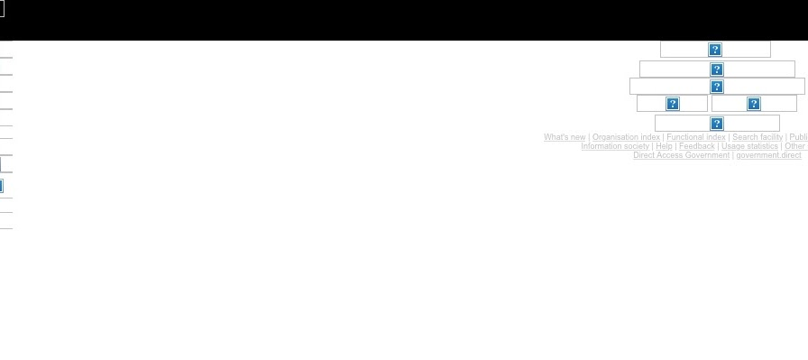
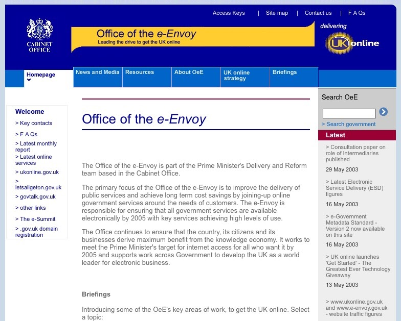
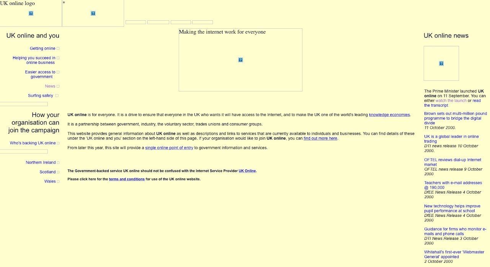
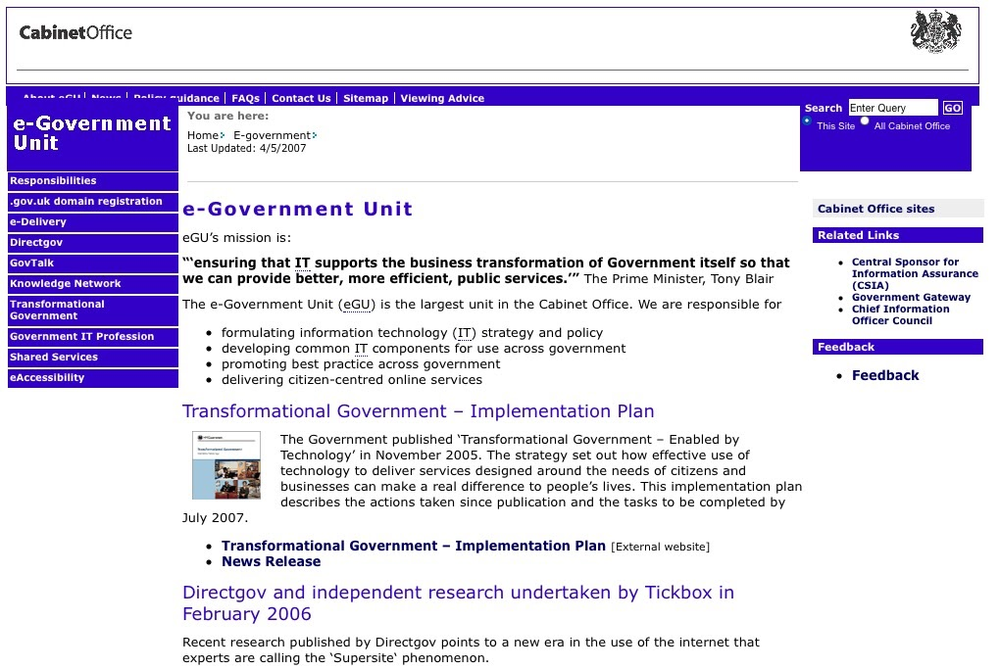
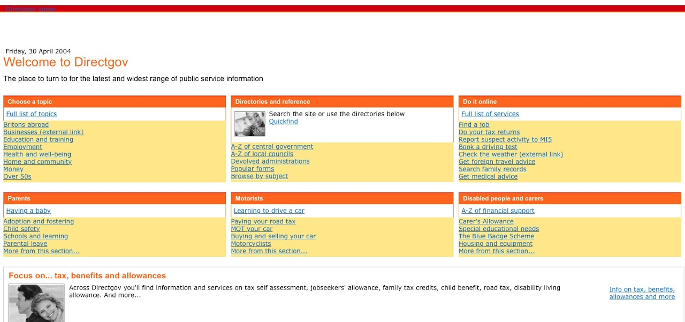
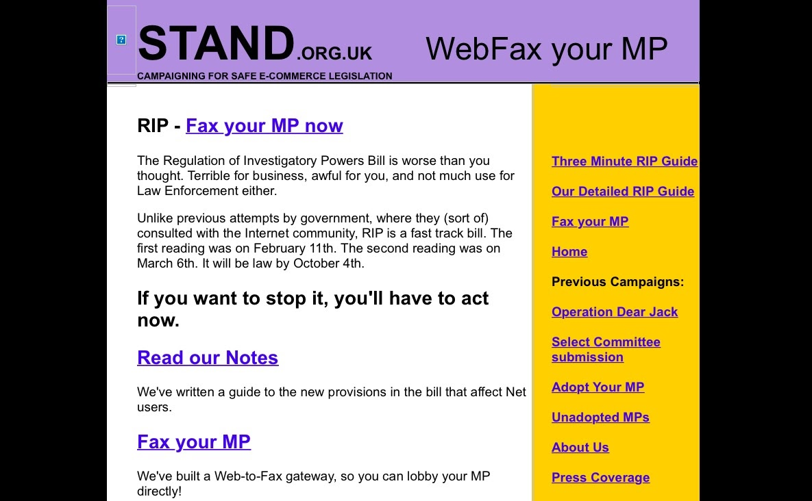
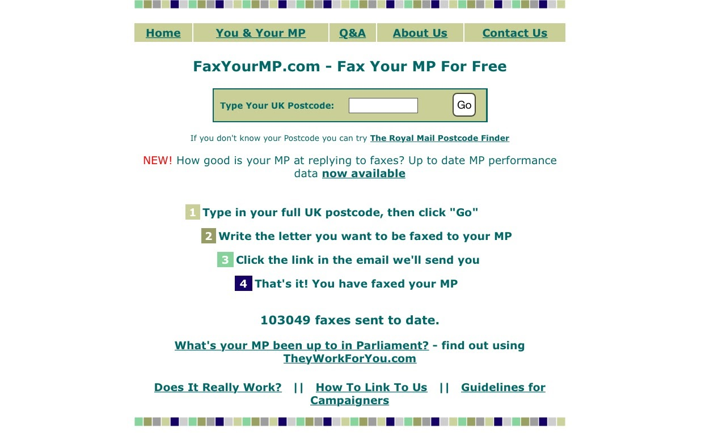
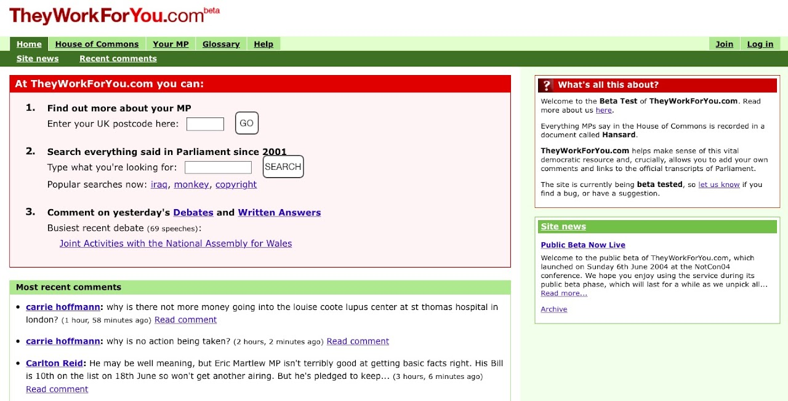

---
---

# How GDS began

*This is the story of what happened **before** GDS was created. There's sometimes a misconception that GDS was the first thing of its kind in government, but that's simply not the case. This story first appeared as a talk, which I did 2 or 3 times in Aviation House. I decided to write it up here on the wiki so that it doesn't get lost. -- [Giles T](https://gilest.org/)*

Most of the time, when we do presentations about our origins, we say that GDS began with the publication of [Martha Lane Fox](http://www.marthalanefox.com)'s letter to Francis Maude, [Revolution not Evolution](https://www.gov.uk/government/publications/directgov-2010-and-beyond-revolution-not-evolution-a-report-by-martha-lane-fox).

In reality, the origins of GDS go back much further than that. GDS was actually the end of a longer path.

It's a path that Martha herself called "the wave of inevitability". Her letter to Maude was the end of the beginning, the culmination of of all sorts of things that contributed to the wave.

By 2010, government had already been thinking about digital change for at least 15 years.

There were all sorts of taskforces, initiatives, research groups, papers and reports. But they were disjointed and disconnected. Each one was created by a small team, working in a particular government department. There was no all-encompassing oversight. There was no-one in charge of digital policy. The whole idea of having a "digital policy" was still some way off.

Let's have a quick look at just a few of those pre-GDS projects.

In 1994, there was a website at www.open.gov.uk. There's not much of it left, even in the [Internet Archive](https://archive.org/):

I'm not a web developer, but as far as I can tell this site's navigation was made entirely with image maps. This dates from the days when most websites used images maps. Those were, as those of us who were around at the time will attest, the days.

Anyway. Let's skip through time a bit.

In 1999, government created an organisation called "The Office of the e-envoy".

No more image maps - this is a website made of good old fashioned HTML. It's quite "Whitehally" - it says things like "improve the delivery of public services" and "all services available electronically by 2005". The news column on the right side talks about a consultation paper, "ESD figures" (whatever they are) and "e-Gov metadata standards".

Skip forward some more: UK online was created in 2000. It was described as "a raft of initiatives to get people, businesses and government itself online". To us today, that sounds like a mix of what we would call transformation (the "government itself" bit) and digital inclusion. The emphasis seems to have been on the latter: in those days, the priority was seen to be simply getting more people online.

Here's a (slightly broken) screenshot from October 2000. (The images are all missing, but you get the idea.)

The very first sentence says: "UK online is for everyone" - an interesting echo of our more recent [6th Design Principle](https://www.gov.uk/design-principles#sixth), "This is for everyone." Our ideas were good ideas, but we weren't always the first people to think of them.

Another echo: "From later this year, this site will provide a single online point of entry for gov information and service." Sounds a bit like GOV.UK, doesn't it?

In 2004, the e-Government Unit was created. It had a website that looked like this:

This is the page where it listed its responsibilities, and number 2 on the list is "citizen-centered public service reform." Again, it echoes things GDS was saying some years later. We used different language ("Users first" and "Start with user needs") but the broader sentiment is much the same.

Directgov, the service that GOV.UK replaced, was set up in 2004.

This is a screenshot taken from the Internet Archive, dated April 2004. What's interesting is how similar it is to today's GOV.UK, in the sense that the primary user interface is a set of themed lists of links.

2005 saw the publication of the [Transformational Government Report](http://webarchive.nationalarchives.gov.uk/20130128101412/http://www.cabinetoffice.gov.uk/cio/transformational_government/strategy.aspx). Among many other recommendations, it said:

> "The future of public services has to use technology to give citizens choice, with personalised services **designed around their needs** and not the needs of the provider."

(I've added the emphasis in that quote: again, it's clear that people were thinking about user needs, 5 years before GDS was created.)

A year later in 2006, government published the [Varney Report](https://www.gov.uk/government/publications/service-transformation-a-better-service-for-citizens-and-businesses-a-better-deal-for-the-taxpayer). It talked about "better collective use of government information" and "citizen-focused, cross-government working" and "less duplication of effort". All of these things became things GDS put its attention on during the Transformation Programme of 2013-15 and the Government as a Platform work that followed.

In 2007-2009, a taskforce called "Power of Information" was run by Labour MP Tom Watson. It had a few things in common with the GDS that followed, namely an emphasis on open data, promotion of "exemplar projects", and a man called Tom Loosemore.

It called for the opening up of government contracts, and for ending the culture of huge IT contracts. Much of what it said is echoed in the Government Digital Strategy that was published a few years later in 2012.

Tom Loosemore once said: "We stand on the shoulders of giants here, never forget that." The giants he was talking about were the civil servants all over government who grasped the importance of the internet early on. They knew they could use it to change things. They knew, after a while, what things they could change and how. **But they never had permission to change anything.**

That's because, while many individuals in government responded to the arrival of the web in the 1990s, government as an institution reacted much more slowly. For a long time, government as an institution simply didn't know what to do with the internet.

## Meanwhile, outside government

Let's go back in time again. While all those government projects were happening, plenty of outsiders were willing to offer their advice.

In 2000, Tom Loosemore and Mike Bracken wrote an article for the New Statesman magazine, titled "A modest proposal". In it, they attacked the state of government technology:

> "Whitehall is in thrall to 6 or 7 large tech consultancies to whom it regularly doles out huge orders for IT solutions."

and

> "[Government is] subsidising vast capital investment in bloated, poorly-designed systems that come in months late and way over budget."

The year 2000 also saw the creation of STAND, a campaign group. Again, Loosemore and Bracken were involved.

STAND was set up to campaign against the Regulation of Investigatory Powers Bill, which was being pushed rapidly through parliament by the then Labour government.

The campaign team realised that the best way to stop the bill becoming law was to persuade MPs to vote against it. And the best way to get them to do that was to encourage lots of people to contact their MPs and complain about the bill.

This was before social media had been invented. Email existed, but it wasn't a widespread consumer product. Most MPs had access to an email account (provided for them by Parliament), but few made use of it much. At the time, most MPs relied on fax machines.

So STAND's idea was simple: build a web-to-fax gateway. Get people to say where they live, type a message into a box, and click "send" - then the message gets turned into a fax and sent to the appropriate MP's fax machine. Ingenious.

As a campaign, STAND was unsuccessful. But the web-to-fax gateway software still had value, so it was later reborn as a new website: FaxYourMP.com. It worked just like STAND, but wasn't about a specific issue. Anyone could use it to contact their MP about anything.

Some of the people who worked on FaxYourMP also worked on a follow-up project: TheyWorkForYou. This was an attempt to make Hansard reports of Parliamentary business easier to read, link to, and comment on.

It was hugely successful. Civil servants and politicians loved it. The attention it got within Whitehall proved useful later on.

In Tom Loosemore's eyes, these projects were attempts to "prod the pig". The team wanted to provoke a reaction. They wanted government as an institution to notice what was happening. They knew they were treading on other people's toes: that was kind of the point.

Another outside influence was the rise of the \*camp events. There were govcamps, teacamps, localgovcamps and others. A small community of people grew up as a result - many of them working within government, people who wanted to see change happen and were willing to advocate it from within. Many of these campers later became GDS staff.

## The Steinberg effect

Around 2003, [Tom Steinberg](http://steiny.typepad.com/) set up mySociety.

Steinberg was a former civil servant and self-confessed geek. He spoke, and could translate between, those two languages. At the time, this was a rare skill.

He set up mySociety because, in his words:

> "There should be more things like FaxYourMP, but it shouldn't have to take 4 years for every new one to come into existence … they shouldn't just have to be volunteer efforts."

So he wanted to create a non-profit organisation that could work on solving that problem, and particularly on building small web-based services for the public good. It was enormously successful.

In 2005, TheyWorkForYou (TWFY) and mySociety merged, with the latter taking responsibility for the websites that the TWFY team had been running in their spare time. This arrangement suited both parties. Looking after TWFY was a huge commitment of time and energy.

Then, in 2009, the Conservative party asked Steinberg to write its technology manifesto prior to the 2010 General Election. Steinberg was wary of this, but agreed on the basis that the Conservatives would let him write what needed to be written, rather than what they wanted him to say. In effect, he would have written exactly the same advice for any political party at the time. In his view, no matter who won the election, they needed to do the same things.

The most important piece of advice he gave the Conservatives was this:

> "You should really only have one technology policy: dismantle and rebuild the centre of digital government. If you don't do that, you can't have any other technology policy."

That "dismantling and rebuilding" sounded drastic, but it was essential. Steinberg had watched the years of reports and taskforces and websites and could clearly see the problem: none of these talented people in government who wanted to change things for the better had permission to do so. "Rebuilding the centre of digital government" was the only way to grant that permission.

## Meanwhile...

Meanwhile, global changes were taking effect.

2008 saw the sudden arrival of global financial instability. Governments everywhere were faced with disastrous shortfalls. Everyone, everywhere, had to find huge budget cuts. This political pressure to lower costs was, in Martha Lane Fox's view, one of the most important elements of the "wave of inevitability".

On the plus side, there was the rise of the internet during the 2000s, from niche nerd interest to global consumer product. Smartphones arrived in 2007, and quickly took possession of our pockets and bags.

## This was the wave

All of these factors - everything outlined so far - formed the wave of inevitability.

At its peak, just before it crashed down, the wave was best summed up like this: **by 2010, the internet had become part of the fabric of the nation. But it was not part of the fabric of government.**

That was what forced change.

The result of the 2010 election was the Conservative / Liberal Democrat coalition government.

Francis Maude was appointed as Minister for the Cabinet Office, and quickly set up a new organisation called the [Efficiency and Reform Group](https://www.gov.uk/government/organisations/efficiency-and-reform-group) (ERG), tasked with cutting costs in government. With that remit, the ERG and Maude had power to insist on change across all departments.

Maude invited Martha Lane Fox to conduct a review of Directgov. She had worked for the previous Labour government as Digital Inclusion Champion (Maude made her "UK Digital Champion"), but crucially did not limit herself to building relationships with Labour MPs. Instead, she "worked hard to be apolitical".

When faced with the brief to "review Directgov" from Francis Maude, she and her team of advisors took the view that they should respond slightly differently. They knew that simply fixing the website wasn't enough. Real change - the sort of change that Tom Steinberg had been talking about in his advice to the Conservatives - goes much deeper.

You can see that in the first paragraph of the letter:

> "Dear Francis, you asked me to oversee a strategic review of Directgov and to report to you by the end of September. I have undertaken this review in the context of my wider remit as UK Digital Champion which includes offering advice on 'how efficiencies can best be realised through the online delivery of public services.' This means I have not reviewed Directgov in isolation but as part of how the government can use the internet both to communicate and interact better with citizens and to deliver significant efficiency savings from channel shift."

That's quite a hard paragraph to take in on first reading, so go back and read it again. Lane Fox made use of her position to expand her remit, and therefore the impact of the report. That was a crucial decision.

That was how the letter got written, and with it the wave of inevitability came crashing down.

Maude used the letter to push change through Cabinet Office. It formed the basis of a todo list - set up a new organisation, give it a mandate (and the power to enforce it), and put someone in charge. In effect: dismantle and rebuild the centre of digital government.

And that's how GDS began.
